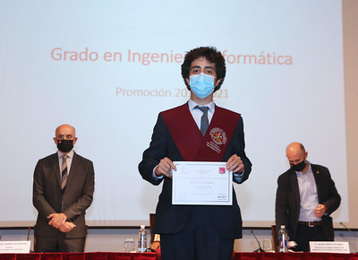
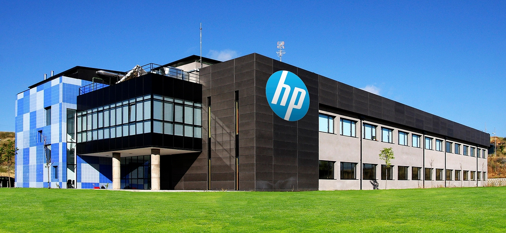
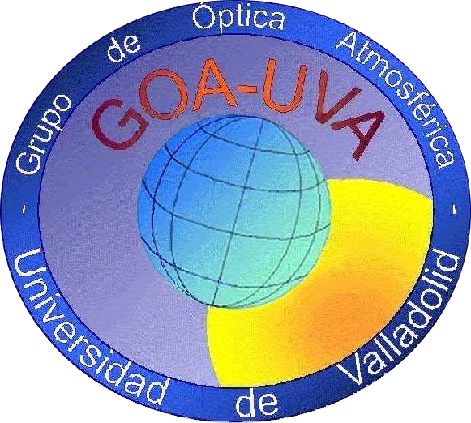

<h3 class="m-3">Who am I?</h3>
I'm Javier Gatón Herguedas, a young computer engineer interested in scientific research.

Take a look at my [Curriculum-vitae][curriculum-url-en]! You can also check the [spanish version][curriculum-url-es].

I graduated in computer engineering, minoring in software engineering at the Universidad de Valladolid in 2021.

I like music, and I studied piano from 7 to 18 years old, finishing the Professional degree
at the Valladolid Professional Conservatory in 2018.

<h3 class="mx-3 mt-5">Studying at University of Valladolid (UVa)</h3>
<h5 class="mx-3 mb-3"><small class="text-muted">Valladolid (Spain) - September 2017 - July 2021</small></h5>

    <figure class="figure float-end col-sm-5 col-md-auto">
        
        <figcaption class="figure-caption text-break">A picture of me at my graduation.</figcaption>
    </figure>
    

        I enjoyed the time spent studying at University of Valladolid (UVa), surrounded by great classmates, and being taught by very proficient computer scientists, engineers and researchers, that in some cases were also really good teachers.
    

    

        While studying at the Universidad de Valladolid I took part in different activities, being these the most notable ones:
    

    <ul>
        <li>Mentor of first-year students at the 2018 and 2019 University of Valladolid Programming Gymkhanas.</li>
        <li>I was a member of the GUI (Grupo Universitario de Informática), where I taught workshops like the <a href="https://www.inf.uva.es/en/2019/03/28/taller-de-terminal-en-linux/">Linux Console Workshop 2019</a>.</li>
        <li>I taught courses at the Hour Of Code, like the <a href="https://github.com/HylianPablo/TallerC_HoC2020">introductory and intermediate <b>C</b> courses at Hour of Code 2020</a>.</li>
        <li>I joined UVaCoders (Competitive Algorithmics Team) in order to hone my skills in algorithmics. With them I took part in multiples coding contest, namely multiple editions of the Cloudflight/Catalysts Coding Contest using <b>Python</b>, <b>C</b> and <b>Java</b>.</li>
        <li>I was a member of the directive committee of the first regional olympiad in informatics, <a href="https://www.inf.uva.es/en/2021/02/01/celebrada-la-1a-olimpiada-informatica-de-castilla-y-leon/">OICyL 2021</a>.</li>
        <li>I did a <b>research internship</b> in the research group <a href="http://goa.uva.es/the-group/">GOA-UVa</a>, working with data from NASA's AERONET photometers.</li>
    </ul>

<h3 class="mx-3 mt-5">Working at HP SCDS</h3>
<h5 class="mx-3 mb-3"><small class="text-muted">León (Spain) - 2021 (July - December)</small></h5>

    <figure class="figure float-end col-sm-5 col-md-4">
        
        <figcaption class="figure-caption">HP SCDS's Zarzuela building (León).</figcaption>
    </figure>
    

        After ending up as a <a href="https://www.inf.uva.es/en/2021/10/04/finalista-en-la-seleccion-de-proyectos-del-xvi-observatorio-tecnologico-hp-2021/">finalist</a> for best undergraduate thesis project with HP SCDS, for <a href="https://github.com/javgat/UVA-DevTest">UVA-DevTest</a>, I was offered a job at HP's Hub in León.
    

    

        Working at HP SCDS was a great experience that showed me what was a real software engineering/developer job like. It was a great place were I met coworkers and managers from whom I learned a lot.
    

    

        Although I had a great time, the time here also showed me that my true vocation was research and teaching.
    

<h3 class="mx-3 mt-5">Research at GOA-UVa</h3>
<h5 class="mx-3 mb-3"><small class="text-muted">Valladolid (Spain) - January 2022 - Present</small></h5>

    <figure class="figure float-end col-sm-4 col-md-3">
        
        <figcaption class="figure-caption">GOA-UVa's logo.</figcaption>
    </figure>
    

        During my internship at GOA-UVa (Grupo de Óptica Atmosférica) in 2021 I was offered a full-time job as a research assistant, and after realizing that I wanted to work on research, I started working here on January 2022.
    

    

        The main project I am working on is the development of the LIME Toolbox, a desktop application for the simulation of lunar observations from Earth. This application is part of European Space Agency's project "Improving the Lunar Irradiance Model of ESA".
    

### Contact
You can find me on GitHub as [javgat](https://github.com/javgat).\
I'm also on Linkedin: [Javier Gatón Herguedas][linkedin-url].

[linkedin-url]: https://linkedin.com/in/javier-gaton-herguedas/
[curriculum-url-en]: ./downloads/javgat_cv_en.pdf
[curriculum-url-es]: ./downloads/javgat_cv_es.pdf
